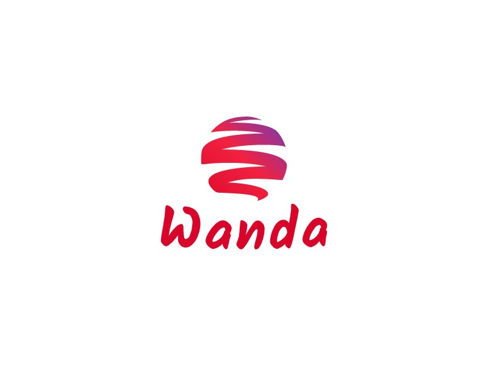

# WANDA

# Welcome to the Wanda Organization

The Wanda Organization is a passionate and creative team dedicated to creating innovative digital solutions to solve everyday problems, particularly in Gabon. Our mission is to create mobile and web applications that bring real value to users. We aspire to use technology to simplify people's lives and facilitate their daily activities. Whether by offering applications for health, entertainment, or productivity, our goal is to address local needs by providing tailored digital solutions.

## Current Projects

Currently, we are working on three exciting projects:

1. **Pharma Plus**: A mobile application that allows users to check the availability of medicines in pharmacies in Libreville, Gabon. This contributes to improving access to healthcare by providing valuable real-time information.

2. **Boss Quest**: A captivating mobile video game that tells the story of a Gabonese individual fighting against various bosses, with the final boss being a man who has kidnapped his son to perform a malevolent ritual. With this game, we offer an entertaining experience that highlights local legends and heroes.

3. **DayWatch**: A streaming platform for movies and series to provide quality entertainment to users. By offering convenient access to diverse cinematic content, we bring joy and relaxation to viewers.

## Why Wanda?

- **Locally Tailored Solutions**: Our products are designed with local needs and preferences in mind, enabling us to provide relevant solutions for the Gabonese market.

- **Innovation and Creativity**: We push the boundaries of creativity to deliver unique and engaging products. Each project is an opportunity to explore new ideas and develop exceptional experiences.

- **Commitment to Quality**: We are committed to delivering high-quality products, with meticulous attention to detail and an outstanding user experience.

## Privacy Policy

All our projects hosted on GitHub are private. As a commercial entity, we are unable to make the source code available to the public. This ensures the security and integrity of our products while protecting the interests of our clients and partners.

## Contact

For any questions, suggestions, or potential collaborations, feel free to reach out to us at the following email address: `codewanda.ga@gmail.com`.

Stay tuned for more exciting updates from the Wanda Team!

# Bienvenue dans l'Organisation Wanda

L'Organisation Wanda est une équipe passionnée et créative dédiée à la création de solutions numériques innovantes pour résoudre des problèmes quotidiens, en particulier au Gabon. Notre mission est de créer des applications mobiles et web qui apportent une réelle valeur ajoutée aux utilisateurs. Nous aspirons à utiliser la technologie pour simplifier la vie des gens et faciliter leurs activités quotidiennes. Que ce soit en proposant des applications pour la santé, le divertissement ou la productivité, notre objectif est de répondre aux besoins locaux en offrant des solutions numériques adaptées.

## Projets en Cours

Actuellement, nous travaillons sur trois projets passionnants :

1. **Pharma Plus** : Une application mobile qui permet aux utilisateurs de consulter la disponibilité des médicaments dans les pharmacies de Libreville, Gabon. Nous contribuons ainsi à l'amélioration de l'accès aux soins de santé en fournissant des informations précieuses en temps réel.

2. **Boss Quest** : Un jeu vidéo mobile captivant qui narre l'histoire d'un Gabonais luttant contre différents boss, le dernier étant un homme qui a enlevé son fils pour accomplir un rituel maléfique. Avec ce jeu, nous proposons une expérience divertissante qui met en valeur les légendes et les héros locaux.

3. **DayWatch** : Une plateforme de streaming de films et de séries pour offrir du divertissement de qualité aux utilisateurs. En proposant un accès pratique à du contenu cinématographique varié, nous apportons du plaisir et de la détente aux spectateurs.

## Pourquoi Wanda ?

- **Solutions Adaptées Localement** : Nos produits sont conçus en gardant à l'esprit les besoins et les préférences locales, ce qui permet de fournir des solutions pertinentes pour le marché gabonais.

- **Innovation et Créativité** : Nous repoussons les limites de la créativité pour offrir des produits uniques et captivants. Chaque projet est une occasion d'explorer de nouvelles idées et de développer des expériences exceptionnelles.

- **Engagement envers la Qualité** : Nous nous engageons à fournir des produits de haute qualité, avec une attention minutieuse aux détails et une expérience utilisateur exceptionnelle.

## Politique de Confidentialité

Tous nos projets hébergés sur GitHub sont privés. En tant qu'entreprise commerciale, nous ne sommes pas en mesure de mettre le code

 source à la disposition du public. Cela garantit la sécurité et l'intégrité de nos produits tout en protégeant les intérêts de nos clients et partenaires.

## Contact

Pour toute question, suggestion ou collaboration potentielle, n'hésitez pas à nous contacter à l'adresse e-mail suivante : `codewanda.ga@gmail.com`.

Restez à l'écoute pour plus de mises à jour passionnantes de la part de l'Équipe Wanda !
